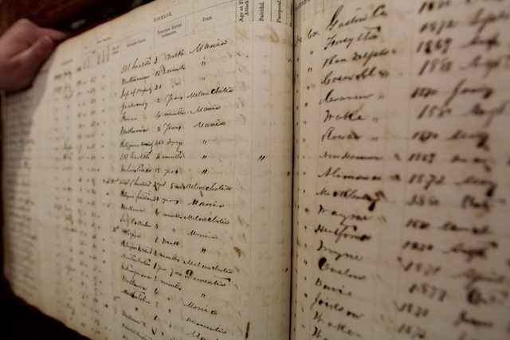

  

## **Dorothea Dix Hospital - Raleigh, NC**

Dorothea Dix Hospital was North Carolina's first psychiatric hospital, with the first patient admitted in 1856. The hospital closed in August 2012 and the last patients were moved to Central Regional Hospital in Butner, North Carolina. The [Final Report](https://dixpark.org/sites/dixpark/files/2018-11/Dix%20Park_Full%20Legacy%20Report_2018.pdf) of the Dix Legacy Committee provides an extensive history of the hospital.
  

* ](photos/dixhospital-reduced.jpg)

  

## **About the Ledger**

The [Community Histories Workshop](communityhistories.org) at UNC-Chapel Hill has created what is believed to be the first comprehensive searchable database of a nineteenth-century American insane asylum, with 7479 admissions between 1856 and 1916. 

  
The admissions ledger contains information about each patient admitted to the hospital, beginning with the hospital's first patient. Demographic information - age, gender, occupation, marital status, and county of residence - for each patient was handwritten into the ledger. Additionally, information about each patient's admittance and stay at the hospital was recorded: date of admittance and discharge, supposed cause and form of illness, duration of symptoms before admittance, number of previous attacks, age at first attack, and final condition with additional space for remarks. 

  

## **About this Project**

We used a de-identified and digitized version of the admissions ledger to perform data cleaning and analysis. 

This project aims to promote further engagement with the admissions ledger with the interactive data visualizations that follow. Our quantitative analyses are primarily for developing hypotheses that can be examined using other primary sources from the era.
  

## **Future Directions**

There are many other sources of information about the Dorothea Dix Hospital and its patients, including interview transcripts, staff meeting notes, genealogy records, and newspaper archives. As of now, these resources are available to provide context and details, but are being analyzed separately.